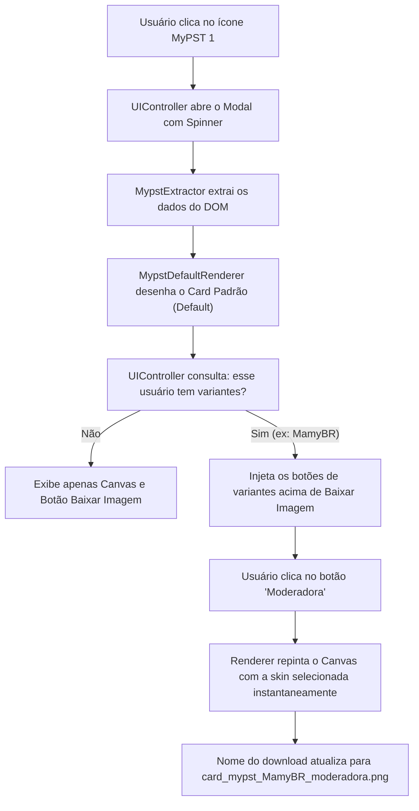

# Análise e Proposta de Solução: Cartões Variados por Usuário (MyPST)

> **Data:** 14 de Setembro de 2026  
> **Status:** Análise Técnica Concluída (Nenhum arquivo existente foi alterado)  
> **Tema:** Implementação de skins e fundos múltiplos para o mesmo jogador no MyPST (ex: "MamyBR", "EduNews", "MGZoio", "FBanin").

---

## 1. A ideia é viável?

**SIM, é 100% viável e é a melhor abordagem técnica e de experiência do usuário (UX).**

### Por que essa abordagem é ideal?
1. **Redesenho Instantâneo (Zero Latência de Rede):**  
   Os dados do jogador (`data`) e todas as imagens remotas já estão carregados na memória pelo `BaseRenderer.loadImages()`. Ao clicar em uma variante, o canvas é repintado em menos de **16 milissegundos** (1 frame). Não é necessário fazer novo scraping nem novas requisições de rede.
2. **Interface Limpa e Não-Invasiva:**  
   A barra de variantes só é exibida se o jogador atual possuir mais de uma skin cadastrada. Para os demais jogadores normais, a interface continua exatamente como está, sem botões sobrando.
3. **Fim das Gambiarras com Espaços:**  
   Antigamente, você precisava adicionar espaços manuais no ID (`" MamyBR"`, `" MamyBR "`) para diferenciar as skins no dicionário. Como hoje o `psnId` vem limpo do DOM (`"MamyBR"`), essa solução substitui a gambiarra por um seletor visual profissional (botões/chips no modal).
4. **Download Dinâmico:**  
   O botão "Baixar Imagem" pode atualizar o nome do arquivo baixado para refletir a skin ativa (ex: `card_mypst_MamyBR_moderadora.png`).

---

## 2. Mapeamento das Variantes Existentes no MyPST

Analisando os arquivos de configuração e renderização, encontramos os seguintes casos clássicos que utilizavam o artifício de espaços no nome:

| Usuário | Espaço Antigo | Skin / Função | Imagem Normal (`normalKey`) | Imagem Perfil (`perfilKey`) |
|---|---|---|---|---|
| **MamyBR** | `"MamyBR"` | Redatora | `basered` | `baseredb` |
| | `" MamyBR"` | Moderadora | `basemod` | `basemodb` |
| | `" MamyBR "` | Noticiarista | `basenot` | `basenotb` |
| **EduNews** | `"EduNews"` | Clube da Platina | `baseplatina` | `imgTperf` (Padrão) |
| | `" EduNews"` | Noticiarista | `basenot` | `basenotb` |
| | `" EduNews "` | Moderador | `basemod` | `basemodb` |
| **FBanin** | `"FBanin"` | Especial Banin | `basebanin` | `basebaninb` |
| | `" FBanin"` | Moderador | `basemod` | `basemodb` |
| **MGZoio** | `"MGZoio"` | Redator | `basered` | `baseredb` |
| | `" MGZoio"` | Denunciante | `baseden` | `basedenb` |
| | `" MGZoio "` | Moderador | `basemod` | `basemodb` |

> **Bônus:** Usuários com apenas 1 skin especial (como "WerneyPark", "LoiroCroft", "LucasIIGD", etc.) também podem ter um botão para alternar entre a sua **Skin Especial** e o **Card Padrão Azul MyPST**, caso prefiram gerar a versão padrão.

---

## 3. Fluxo de Funcionamento (Como Funciona)



---

## 4. Arquitetura da Solução: Como Implementar Passo a Passo

### Passo 1: Estruturar as Variantes em `content/config/mypstSpecialUsers.js`
Substituir as entradas com espaços por um array claro de variantes:

```javascript
const MYPST_USER_VARIANTS = {
    "MamyBR": [
        { id: "redatora", label: "Redatora", normalKey: "basered", perfilKey: "baseredb", isDefault: true },
        { id: "moderadora", label: "Moderadora", normalKey: "basemod", perfilKey: "basemodb" },
        { id: "noticiarista", label: "Noticiarista", normalKey: "basenot", perfilKey: "basenotb" }
    ],
    "EduNews": [
        { id: "platina", label: "Platina", normalKey: "baseplatina", perfilKey: "imgTperf", isDefault: true },
        { id: "noticiarista", label: "Noticiarista", normalKey: "basenot", perfilKey: "basenotb" },
        { id: "moderador", label: "Moderador", normalKey: "basemod", perfilKey: "basemodb" }
    ],
    "FBanin": [
        { id: "exclusiva", label: "Especial Banin", normalKey: "basebanin", perfilKey: "basebaninb", isDefault: true },
        { id: "moderador", label: "Moderador", normalKey: "basemod", perfilKey: "basemodb" }
    ],
    "MGZoio": [
        { id: "redator", label: "Redator", normalKey: "basered", perfilKey: "baseredb", isDefault: true },
        { id: "denunciante", label: "Denunciante", normalKey: "baseden", perfilKey: "basedenb" },
        { id: "moderador", label: "Moderador", normalKey: "basemod", perfilKey: "basemodb" }
    ]
};

/**
 * Retorna as variantes disponíveis para um PSN ID (ou array vazio se não houver).
 */
function getMypstUserVariants(psnId) {
    if (!psnId) return [];
    return MYPST_USER_VARIANTS[psnId] || [];
}
```

---

### Passo 2: Atualizar `MypstDefaultRenderer.js` para suportar `variantId`
Permitir que o método `renderCard` receba uma opção com a variante escolhida:

```javascript
async renderCard(data, ctx, canvas, options = {}) {
    // ... carregamento de imagens e dimensões normais ...

    const psnId = data.psnId || '';
    const variants = getMypstUserVariants(psnId);
    
    // Identifica a variante ativa (ou a padrão)
    let activeVariant = null;
    if (options.variantId) {
        activeVariant = variants.find(v => v.id === options.variantId);
    } else if (variants.length > 0) {
        activeVariant = variants.find(v => v.isDefault) || variants[0];
    }

    // Define quais imagens de base desenhar
    let normalImg = images.imgFundo;
    let perfilImg = images.imgTperf;

    if (activeVariant) {
        normalImg = images[activeVariant.normalKey] || images.imgFundo;
        perfilImg = images[activeVariant.perfilKey] || images.imgTperf;
    } else {
        // Fallback para usuários de skin única existentes
        const legacyBases = resolveMypstUserBases(psnId, images, images.imgFundo, images.imgTperf);
        normalImg = legacyBases.normal;
        perfilImg = legacyBases.perfil;
    }

    // Desenha o fundo e a moldura do avatar correspondente
    ctx.drawImage(normalImg, 0, 0);
    if (images.avatar) {
        ctx.drawImage(images.avatar, 91, 91, 300, 300);
        if (perfilImg) ctx.drawImage(perfilImg, 0, 0);
    }

    // ... restante dos textos, troféus, nível e badges permanecem idênticos ...
}
```

E no `MypstDefaultRenderer`, expor um método de consulta simples:
```javascript
getAvailableVariants(psnId) {
    return getMypstUserVariants(psnId);
}
```

---

### Passo 3: Atualizar `UIController.js` para Gerenciar o Seletor no Modal
No `UIController`, adicionamos um container dedicado `#projectcardex-variants` dentro do modal HTML:

```html
<div class="psxt-modal-content projectcardex-modal-content">
    <span class="psxt-modal-close">&times;</span>
    <h2 id="psxt-modal-status">Lendo dados principais...</h2>
    <div id="psxt-modal-spinner" class="projectcardex-spinner"></div>
    <canvas id="cartaoCanvas"></canvas>
    
    <!-- CONTAINER DINÂMICO DE VARIANTES (ACIMA DO BOTÃO DE DOWNLOAD) -->
    <div id="projectcardex-variants-container" class="projectcardex-variants-container"></div>
    
    <button id="psxt-download-btn" class="psxt-card-btn">Baixar Imagem</button>
</div>
```

Na função `handleGenerateCardClick`:
```javascript
// Após renderizar o cartão base inicial:
const variants = typeof renderer.getAvailableVariants === 'function' 
    ? renderer.getAvailableVariants(data.psnId) 
    : [];

const variantsContainer = modal.querySelector('#projectcardex-variants-container');
variantsContainer.innerHTML = ''; // Limpa botões anteriores

if (variants && variants.length > 1) {
    let currentVariantId = (variants.find(v => v.isDefault) || variants[0]).id;

    // Cria a barra de título ou botões de seleção
    const title = document.createElement('span');
    title.className = 'projectcardex-variants-title';
    title.innerText = 'Variações de Cartão:';
    variantsContainer.appendChild(title);

    const buttonsWrapper = document.createElement('div');
    buttonsWrapper.className = 'projectcardex-variants-buttons';

    variants.forEach(variant => {
        const btn = document.createElement('button');
        btn.className = `projectcardex-variant-chip ${variant.id === currentVariantId ? 'active' : ''}`;
        btn.innerText = variant.label;

        btn.onclick = async () => {
            // Atualiza o estado ativo dos botões
            buttonsWrapper.querySelectorAll('.projectcardex-variant-chip').forEach(b => b.classList.remove('active'));
            btn.classList.add('active');
            currentVariantId = variant.id;

            // Repinta o canvas imediatamente com a variante escolhida
            await renderer.renderCard(data, ctx, canvas, { variantId: variant.id });

            // Atualiza o link de download para incluir o nome da variante
            downloadBtn.onclick = () => {
                const link = document.createElement('a');
                link.download = `card_${rendererName}_${data.psnId || 'jogador'}_${variant.id}.png`;
                link.href = canvas.toDataURL("image/png", 1.0);
                link.click();
            };
        };

        buttonsWrapper.appendChild(btn);
    });

    variantsContainer.appendChild(buttonsWrapper);
    variantsContainer.style.display = 'flex';
} else {
    variantsContainer.style.display = 'none';
}
```

---

### Passo 4: Estilos dos Botões de Variante em `styles/common.css`
Botões em formato de *pills* / *chips*, elegantes e visualmente destacados:

```css
/* Container de Variantes no Modal */
.projectcardex-variants-container {
  display: flex;
  flex-direction: column;
  align-items: center;
  gap: 8px;
  margin: 15px 0 5px 0;
  width: 100%;
}

.projectcardex-variants-title {
  font-size: 12px;
  font-weight: bold;
  text-transform: uppercase;
  letter-spacing: 0.8px;
  color: #a0c0ff;
}

.projectcardex-variants-buttons {
  display: flex;
  gap: 8px;
  flex-wrap: wrap;
  justify-content: center;
}

/* Botões / Chips de cada variante */
.projectcardex-variant-chip {
  background: rgba(255, 255, 255, 0.1);
  color: #ffffff;
  border: 1px solid rgba(255, 255, 255, 0.3);
  padding: 6px 16px;
  border-radius: 20px;
  font-size: 13px;
  font-weight: 600;
  cursor: pointer;
  transition: all 0.2s ease-in-out;
  outline: none;
}

.projectcardex-variant-chip:hover {
  background: rgba(62, 177, 232, 0.3);
  border-color: #3eb1e8;
  transform: translateY(-2px);
}

.projectcardex-variant-chip.active {
  background: linear-gradient(90deg, #235bc2, #3eb1e8);
  border-color: #ffffff;
  box-shadow: 0 0 12px rgba(62, 177, 232, 0.6);
  transform: scale(1.05);
}
```

---

## 5. Comparativo: Antes vs Depois

| Aspecto | Antes (Método Antigo) | Depois (Proposta com Seletor no Modal) |
|---|---|---|
| **Como selecionava** | Espaços manuais no ID (`" MamyBR"`, `" MamyBR "`) | Botões visuais estilizados no modal ("Redatora", "Moderadora") |
| **Compatibilidade com Scraping** | Incompatível (o ID raspado sempre vinha sem espaços) | **100% compatível** (o ID raspado é limpo e as opções são dinâmicas) |
| **Velocidade** | N/A | **Instantânea** (redesenho no Canvas sem novo fetch de rede) |
| **Experiência do Usuário (UX)** | Oculto e confuso | **Intuitivo, visual e interativo** |
| **Download** | Nome genérico | Nome com sufixo da skin escolhida |
| **Extensibilidade** | Difícil de adicionar novas skins | Basta adicionar um item no array `MYPST_USER_VARIANTS` |

---

## 6. Conclusão e Recomendação

A sua proposta de **gerar o card padrão e colocar as opções logo acima do botão de salvar** é:
1. **Perfeitamente viável**;
2. **Tecnicamente muito superior** ao sistema antigo de espaços;
3. **Fácil de implementar** graças à modularização que acabamos de fazer (onde a configuração de usuários VIP já está separada em `mypstSpecialUsers.js` e a renderização já está desacoplada).

Quando desejar aplicar essa implementação no código, basta confirmar que executamos os passos 1 a 4 com total segurança!
